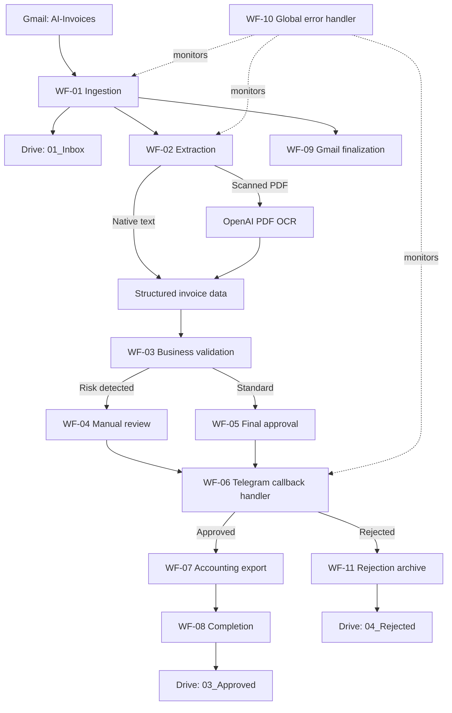
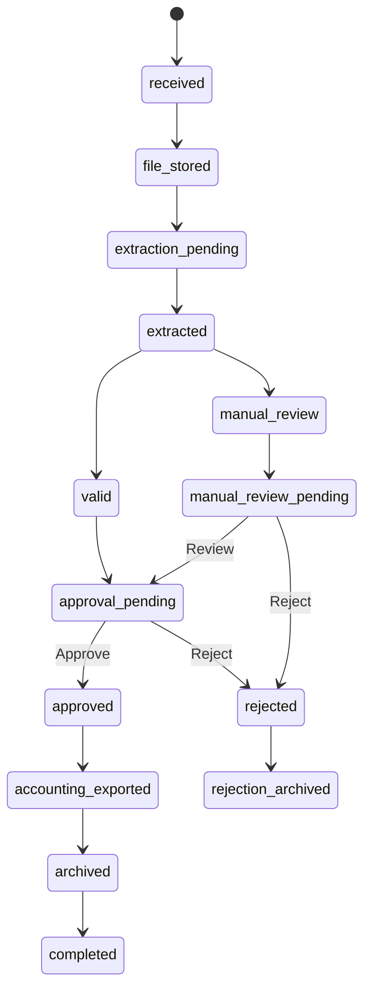
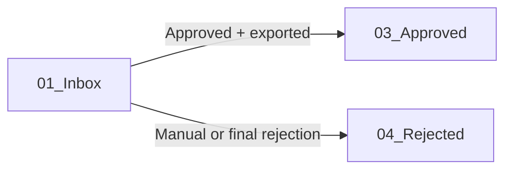

# AI Invoice Processing & Approval Automation

> Production-oriented invoice automation ecosystem for Gmail ingestion, PDF extraction, OCR fallback, vendor validation, duplicate detection, human approval, accounting export, document archiving, and centralized error handling built with **n8n**, **OpenAI**, **Gmail**, **Google Drive**, **Google Sheets**, and **Telegram**.

[](https://n8n.io)
[](https://openai.com)
[](https://developers.google.com/gmail/api)
[](https://developers.google.com/drive)
[](https://core.telegram.org/bots/api)

---

## Table of Contents

- [Overview](#overview)
- [Business Problem](#business-problem)
- [Solution](#solution)
- [System Architecture](#system-architecture)
- [Repository Structure](#repository-structure)
- [Workflow Catalog](#workflow-catalog)
- [Invoice Lifecycle](#invoice-lifecycle)
- [Validation Rules](#validation-rules)
- [Data Model](#data-model)
- [Google Drive Structure](#google-drive-structure)
- [Setup](#setup)
- [Configuration](#configuration)
- [Testing Strategy](#testing-strategy)
- [Error Handling](#error-handling)
- [Security and Production Notes](#security-and-production-notes)
- [Expected Business Outcomes](#expected-business-outcomes)
- [Tech Stack](#tech-stack)
- [Roadmap](#roadmap)
- [License](#license)

---

## Overview

Finance teams often receive dozens or hundreds of supplier invoices through email. Each document must be downloaded, read, validated, checked against vendor master data, routed to the correct manager, entered into an accounting register, and archived.

This project automates that lifecycle with eleven modular n8n workflows. It supports both text-based and scanned PDFs, performs deterministic business validation around the AI extraction layer, and keeps a human in the loop whenever risk is detected.

The system is designed around three principles:

1. **AI extracts; business rules decide.** The model reads invoice data, while deterministic code validates vendors, banking details, duplicates, deadlines, and authorization.
2. **Risky invoices require human review.** Unknown vendors, bank changes, duplicates, overdue documents, and incomplete extraction are never silently approved.
3. **Every operation is traceable.** Invoice state, approval history, accounting export, Drive location, Gmail labels, and workflow errors are recorded.

---

## Business Problem

Manual invoice processing creates recurring operational risks:

- 10-15 minutes of manual work per invoice;
- repetitive copying of vendor names, dates, amounts, and bank details;
- missed or duplicated invoices;
- unauthorized bank account changes;
- inconsistent approval decisions;
- delayed payments and overlooked due dates;
- limited visibility into processing failures;
- documents scattered across inboxes and folders.

---

## Solution

The automation receives PDF invoices from a controlled Gmail label and runs them through a complete processing pipeline:

- downloads and splits PDF attachments;
- creates a stable processing identifier for every attachment;
- prevents duplicate technical processing;
- uploads new documents to Google Drive;
- extracts native PDF text when available;
- falls back to OpenAI PDF OCR for scanned documents;
- converts the document into a strict accounting schema;
- validates the vendor against a master-data table;
- compares sender, currency, tax ID, and IBAN;
- checks for business duplicates and overdue invoices;
- routes standard invoices to approval and risky invoices to manual review;
- processes Telegram callback buttons securely;
- exports approved invoices to an accounting register;
- archives approved and rejected documents separately;
- finalizes Gmail labels;
- records production failures and alerts an administrator.

---

## System Architecture



---

## Repository Structure

```text
.
├── README.md
├── workflows/
│   ├── WF#1 - invoice__ingestion--gmail.json
│   ├── WF#2 - invoice__extraction--document.json
│   ├── WF#3 - invoice__validation--business-rules.json
│   ├── WF#4 - invoice__manual-review--telegram.json
│   ├── WF#5 - invoice__approval--telegram.json
│   ├── WF#6 - invoice__approval-handler--telegram.json
│   ├── WF#7 - invoice__accounting--google-sheets.json
│   ├── WF#8 - invoice__completion--archive.json
│   ├── WF#9 - invoice__gmail--finalize-message.json
│   ├── WF#10 - invoice__error-handler--global.json
│   └── WF#11 - invoice__rejection--archive.json
├── docs/
│   └── sheet_schema.md
└── LICENSE
```

> Import exported workflows using **n8n -> Workflows -> Import from File**. After importing, reselect every referenced sub-workflow and credential because n8n resource IDs are environment-specific.

---

## Workflow Catalog

### 1. `WF#1 - invoice__ingestion--gmail.json`

The main orchestration workflow.

| Stage | Responsibility |
|---|---|
| Gmail trigger | Polls messages carrying the `AI-Invoices` label |
| Attachment processing | Downloads the message and splits every PDF into an individual n8n item |
| Identity | Builds `DOC-{gmail_message_id}-{attachment_index}` |
| Technical idempotency | Looks up `processing_id` before uploading or creating a register row |
| State routing | Routes records to `new`, `resume_extraction`, `skip_existing`, or `error` |
| Storage | Uploads new PDFs to `01_Inbox` |
| Orchestration | Calls extraction, validation, approval, and Gmail finalization workflows |

The resume path can restart extraction for a previously stored file without creating another Drive copy.

### 2. `WF#2 - invoice__extraction--document.json`

Hybrid document extraction workflow.

1. Attempts native PDF text extraction.
2. Evaluates whether the extracted text is sufficient.
3. Restores the original binary when OCR is required.
4. Sends scanned PDFs to OpenAI PDF OCR.
5. Passes native or OCR text into a strict Information Extractor schema.
6. Normalizes invoice fields and extraction metadata.

Extracted fields include:

- supplier legal name and tax ID;
- invoice number;
- invoice and due dates;
- currency, subtotal, tax, and total;
- account holder, IBAN, SWIFT/BIC, and bank name;
- payment reference;
- confidence and missing fields.

### 3. `WF#3 - invoice__validation--business-rules.json`

Deterministic validation layer built around the AI result.

- looks up the supplier by tax ID;
- verifies active vendor status;
- compares sender email;
- compares invoice IBAN to the registered IBAN;
- validates currency;
- checks invoice business-key duplicates;
- calculates overdue state;
- generates risk flags;
- assigns `valid`, `warning`, `manual_review`, or `invalid`;
- updates the `Invoices` register.

### 4. `WF#4 - invoice__manual-review--telegram.json`

Routes risky invoices to the correct manager.

- resolves the approval rule by currency and amount;
- prepares a risk-focused Telegram message;
- sends `Review` and `Reject` callback buttons;
- saves `manual_review_pending` and manager assignment.

### 5. `WF#5 - invoice__approval--telegram.json`

Prepares final approval after standard validation or completed manual review.

- refreshes the vendor master record;
- resolves the responsible manager;
- includes validation notes and Drive link;
- sends `Approve` and `Reject` callback buttons;
- saves `approval_pending`.

### 6. `WF#6 - invoice__approval-handler--telegram.json`

Central callback and authorization workflow.

- accepts Telegram `/start` and callback updates;
- parses `action|processing_id` callback payloads;
- acknowledges Telegram callbacks;
- retrieves the invoice from Google Sheets;
- verifies that the Telegram user is the assigned manager;
- rejects stale or unauthorized decisions;
- handles manual `review` and `reject` actions;
- handles final `approve` and `approval_reject` actions;
- edits the existing Telegram message;
- sends approved invoices to accounting and completion;
- sends rejected invoices to rejection archiving.

### 7. `WF#7 - invoice__accounting--google-sheets.json`

Idempotent accounting export adapter.

- accepts approved invoices only;
- validates required accounting fields;
- creates `ACC-{invoice_id}`;
- uses `Append or Update Row` to prevent duplicate exports;
- writes the result to `Accounting_Export`.

This workflow is the extension point for QuickBooks, Xero, SAP, NetSuite, or another ERP.

### 8. `WF#8 - invoice__completion--archive.json`

Completes the approved lifecycle.

- requires a successful accounting export;
- moves the PDF to `03_Approved`;
- updates `Invoices.status` to `completed`;
- returns an auditable completion result.

### 9. `WF#9 - invoice__gmail--finalize-message.json`

Finalizes Gmail only after all PDF attachments from the message are registered.

- counts invoice rows for the Gmail message;
- supports messages containing multiple PDFs;
- adds `AI-Invoices-Processed`;
- removes `AI-Invoices`;
- marks the message as read;
- defers finalization when another attachment is still incomplete.

### 10. `WF#10 - invoice__error-handler--global.json`

Central production error workflow.

- receives n8n Error Trigger events;
- extracts workflow, node, execution, processing, and Gmail identifiers;
- upserts `Processing_Log`;
- adds `AI-Invoices-Error` when the Gmail message is known;
- removes the active source label to prevent infinite retries;
- sends a formatted Telegram alert with an execution link.

### 11. `WF#11 - invoice__rejection--archive.json`

Reusable rejection lifecycle.

- accepts rejected invoices only;
- resolves the Drive file ID;
- moves the PDF to `04_Rejected`;
- preserves rejection comments and timestamps;
- updates the invoice register to `rejected`.

---

## Invoice Lifecycle



### Stable identifiers

| Identifier | Format | Purpose |
|---|---|---|
| `processing_id` | `DOC-{gmail_message_id}-{attachment_index}` | Technical idempotency per Gmail attachment |
| `invoice_id` | `INV-{vendor_tax_id}-{invoice_number}` | Business invoice identity |
| `accounting_entry_id` | `ACC-{invoice_id}` | Idempotent accounting export |

---

## Validation Rules

| Rule | Risk when failed |
|---|---|
| Required extraction fields present | `missing_fields` / invalid extraction |
| Vendor tax ID exists in `Vendors` | `vendor_not_found` |
| Vendor is active | inactive vendor |
| Sender matches vendor contact | sender mismatch |
| Currency matches vendor master data | currency mismatch |
| Invoice IBAN matches registered IBAN | `iban_mismatch` |
| Invoice business key is unique | duplicate invoice |
| Due date has not passed | overdue invoice |
| Callback actor matches assigned manager | authorization failure |
| Accounting export receives approved status | hard workflow error |

The AI model never makes the final approval decision. It extracts structured data; deterministic rules and authorized managers control the outcome.

---

## Data Model

The Google Sheets database contains five operational sheets:

| Sheet | Purpose |
|---|---|
| `Invoices` | Main invoice state and approval register |
| `Vendors` | Supplier master data and registered bank details |
| `Approval_Matrix` | Currency and amount-based manager routing |
| `Accounting_Export` | Idempotent accounting handoff |
| `Processing_Log` | Central production error log |

The exact column definitions are available in [`docs/sheet_schema.md`](docs/sheet_schema.md).

---

## Google Drive Structure

```text
AI Invoice Processing/
├── 01_Inbox/       # Newly received documents
├── 03_Approved/    # Approved and accounting-exported invoices
└── 04_Rejected/    # Rejected invoices
```



---

## Setup

### Prerequisites

- n8n Cloud or a recent self-hosted n8n version;
- Gmail account with OAuth access;
- Google Drive and Google Sheets OAuth access;
- OpenAI API credential with access to the configured model;
- Telegram bot and approver chat/user ID;
- Google Sheets workbook created from the documented schema.

### Recommended import order

Import reusable sub-workflows first:

1. `WF#2 - invoice__extraction--document.json`
2. `WF#3 - invoice__validation--business-rules.json`
3. `WF#4 - invoice__manual-review--telegram.json`
4. `WF#5 - invoice__approval--telegram.json`
5. `WF#7 - invoice__accounting--google-sheets.json`
6. `WF#8 - invoice__completion--archive.json`
7. `WF#9 - invoice__gmail--finalize-message.json`
8. `WF#10 - invoice__error-handler--global.json`
9. `WF#11 - invoice__rejection--archive.json`
10. `WF#6 - invoice__approval-handler--telegram.json`
11. `WF#1 - invoice__ingestion--gmail.json`

After importing:

1. reconnect Gmail, Google Sheets, Google Drive, OpenAI, and Telegram credentials;
2. reselect every Execute Sub-workflow target;
3. select the correct spreadsheet in every Google Sheets node;
4. select `01_Inbox`, `03_Approved`, and `04_Rejected` in Drive nodes;
5. select `invoice__error-handler--global` as the Error Workflow for production workflows;
6. remove all pinned development data;
7. activate only the Gmail ingestion and Telegram handler trigger workflows.

### Gmail labels

Create:

```text
AI-Invoices
AI-Invoices-Processed
AI-Invoices-Error
```

Configure the Gmail Trigger with:

```text
Label: AI-Invoices
Read status: Unread only
Search: has:attachment filename:pdf
```

---

## Configuration

Replace environment-specific references after import:

- Google Spreadsheet ID;
- Google Drive folder IDs;
- Gmail label IDs;
- Telegram bot credential;
- Telegram manager/admin IDs;
- n8n sub-workflow IDs;
- OpenAI credential and model;
- approval amount thresholds;
- vendor master data.

### Example vendor record

```text
vendor_id: VENDOR-001
vendor_name: Supplier Legal Name
vendor_tax_id: VAT_OR_TAX_ID
contact_email: invoices@supplier.example
iban: REGISTERED_IBAN
default_currency: EUR
manager_id: TELEGRAM_USER_ID
is_active: true
```

---

## Testing Strategy

Run scenarios sequentially and verify Google Sheets, Drive, Gmail, and Telegram after each one.

| Scenario | Expected route | Expected result |
|---|---|---|
| Registered vendor, matching IBAN | Native extraction -> final approval | Accounting export, `03_Approved`, `completed` |
| Unknown vendor | Manual review | Review or rejection required |
| Same vendor tax ID + invoice number | Duplicate validation | Manual review; no second accounting export |
| Scanned PDF + changed IBAN | OCR -> manual review | `openai_pdf_ocr`, `iban_mismatch` |
| Overdue invoice | Manual review | Explicit human decision required |
| Repeated Gmail event | Technical duplicate route | No new Drive file or register row |
| Controlled workflow failure | Global error handler | `Processing_Log`, Telegram alert, Gmail error label |

### Acceptance checks

- no duplicate Drive upload for the same `processing_id`;
- no duplicate accounting row for the same `accounting_entry_id`;
- scanned documents use OCR fallback;
- unauthorized Telegram users cannot approve invoices;
- rejected invoices never reach accounting;
- approved invoices reach `completed` only after accounting export and archiving;
- all production errors create a traceable log record.

---

## Error Handling

The global error workflow records:

- error ID and timestamp;
- workflow and node;
- execution ID and URL;
- execution mode;
- error message;
- processing and Gmail identifiers when available;
- severity and resolution status.

Error Trigger workflows run for production executions, not ordinary manual editor runs. Use a controlled trigger-based failure to verify the production error path.

---

## Security and Production Notes

- Never commit OAuth tokens, API keys, Telegram bot tokens, or n8n API keys.
- n8n workflow exports may contain internal credential IDs, spreadsheet IDs, folder IDs, label IDs, chat IDs, and webhook IDs. Replace or redact them before publishing a public repository.
- Restrict Google Drive and Sheets access to the minimum required accounts.
- Treat bank-detail changes as high-risk even when AI confidence is high.
- Keep successful and failed production executions during rollout; apply a retention policy after stabilization.
- Google Sheets is suitable for an MVP and moderate volume, but it is not a transactional database. For higher concurrency, move state and idempotency keys to PostgreSQL or another transactional store.
- Review invoice retention and personal-data requirements for the jurisdictions in which the system operates.

---

## Expected Business Outcomes

The system is designed to target:

- invoice handling time reduced from **10-15 minutes to 1-2 minutes** for standard documents;
- **70-85%** straight-through processing for known vendors with consistent invoices;
- fewer manual data-entry errors;
- automatic detection of duplicates, overdue invoices, and bank-detail changes;
- complete approval and error audit trail;
- scalable processing without proportional finance-team headcount growth.

Actual results depend on document quality, vendor consistency, approval policy, and transaction volume.

---

## Tech Stack

- n8n Cloud
- OpenAI GPT-4.1 mini
- Gmail API
- Google Drive API
- Google Sheets API
- Telegram Bot API
- JavaScript Code nodes
- Native PDF text extraction
- OpenAI PDF OCR fallback
- OAuth 2.0

---

## Roadmap

- QuickBooks or Xero accounting adapter;
- PostgreSQL-based idempotency and concurrency control;
- scheduled overdue reminders and escalation;
- multi-level approval matrices;
- vendor onboarding workflow;
- bank-account change verification with a second approver;
- Slack approval channel;
- operational dashboard and processing SLA metrics;
- automatic reconciliation with ERP payment status.

---

## License

This project is licensed under the MIT License.